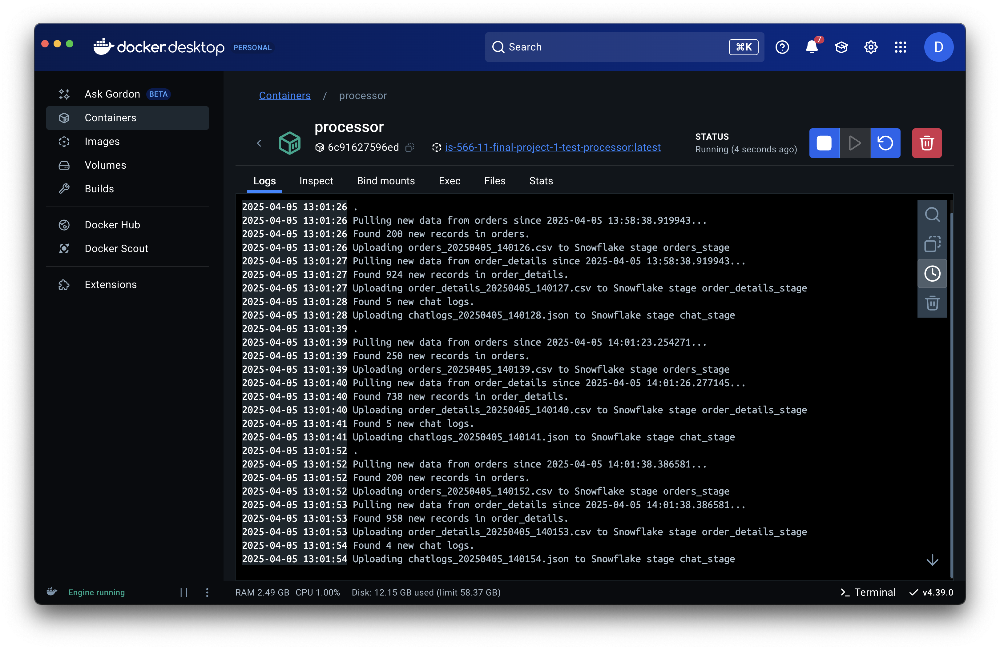
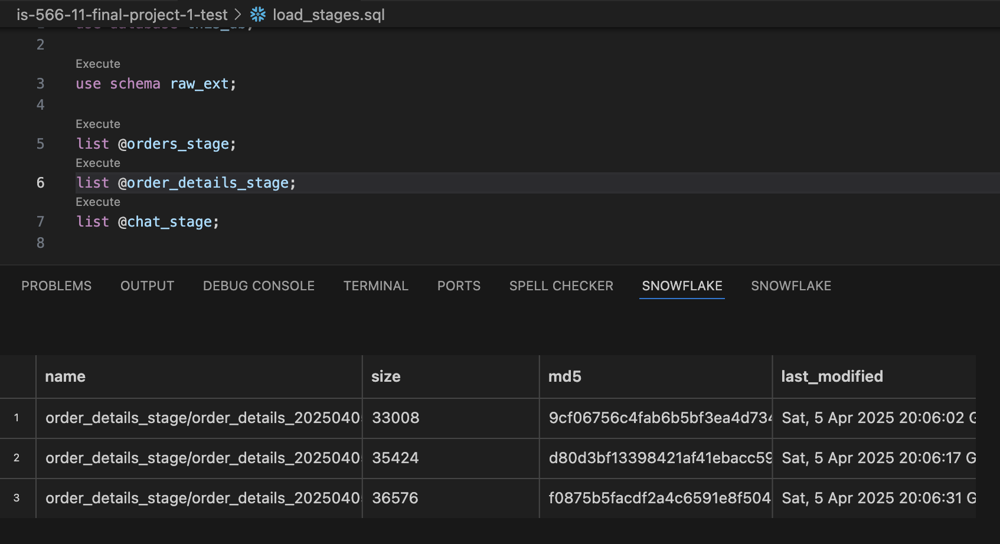
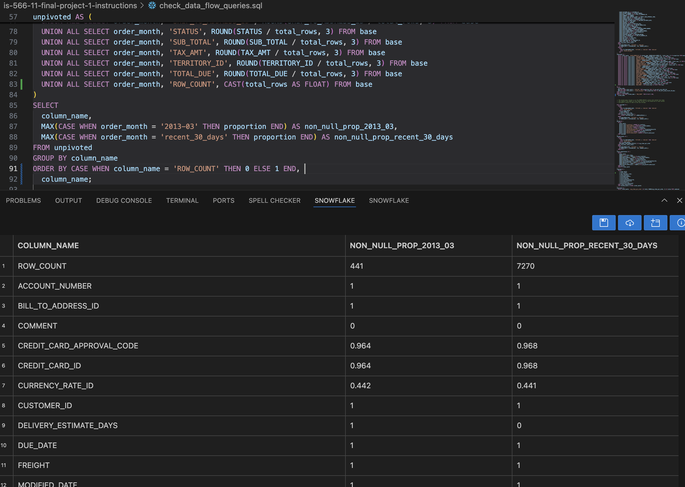
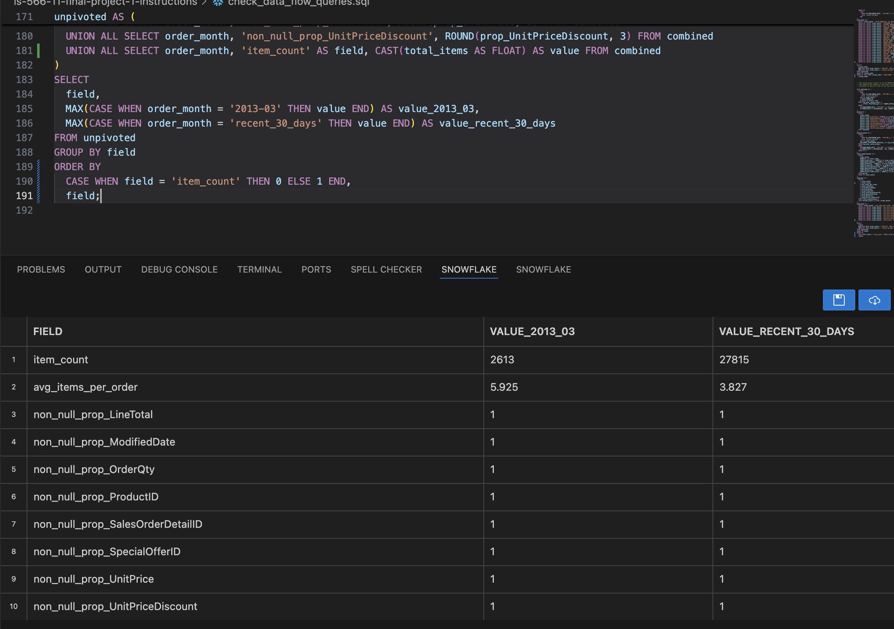
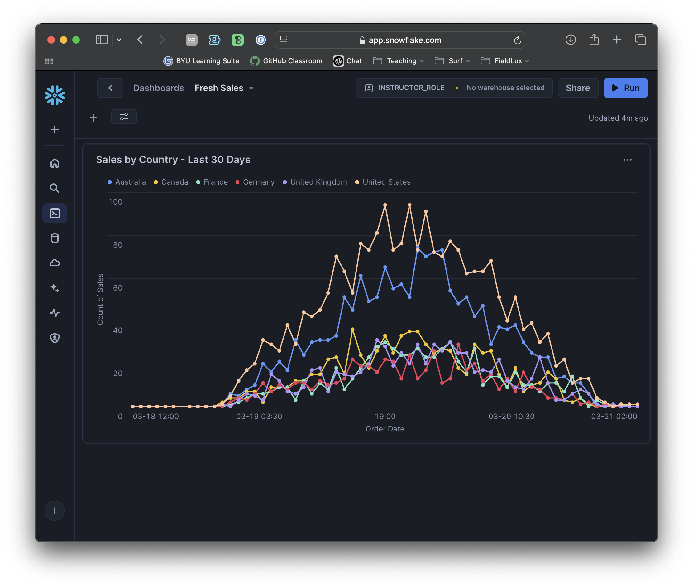

# Final Project // Milestone 1: Full-Stack Data Pipeline Integration Instructions

Well, my friends. We're here. The journey has been long and arduous, but we've learned a lot along the way. And to help you demonstrate (to me, a future intereviewer, and most importantly, to _yourself_) that you have indeed learned _a ton_ here in this class, this final project will bring it all together in a single flow. This project (across the three milestones) will be your finest work yet, and something you will be proud and excited to talk about with your future employers.

As you might expect, this project will flow a bit differently compared to the labs we've worked on. Each of those labs was an extremely detailed, close-up view of how to use a particular technology to accomplish something that relates to data engineering. There was plenty of "learn by doing" in which I asked you to explore some things, teach yourself about how to accomplish something, and gave you fairly particular requirements about what the end product should look like.

By contrast, this project will be much more "zoomed out", and you'll be asked to build various componenets of a full data pipeline with much less guidance from me. Nearly everything I'm asking you to do will be something that we have already done in a prior lab assignment. (The few new things I'm adding in will be accompanied by some detailed examples and a video walkthrough explaining anything you need to know.) 

## Project Scenario

My plan is to treat this project like a real-world data team project. I will be acting as your manager, and you'll be given tasks that I would ask a junior membor of my team to accomplish. In a real-world project, managers don't usually do a lot of hand-holding (nor do you want them to!). Instead, a good manager will ask you to work on something, give clear guidelines and context about what you're supposed to accomplish and why, but not get lost in the details. Very soon, you'll join a team in the workforce, and this is 100% the type of situation you'll find yourself in. So we're going to give you some exposure to that. 

As usual, I’ve broken down the milestone into four key tasks. For each, I’ll describe the goal in managerial terms and list specific objectives you should meet. Remember, these are high-level requirements – you’ll need to determine how to achieve them using the skills and tools you’ve acquired over the course of the semester. 

Below is an overview of the full system, with some highlights indicating where each of the tasks fit in the bigger picture:


And here's a rough idea of what the ending file system looks like, but, as you'll find out below, I'm not being prescriptive about how you name things, so this is just here in case it's helpful.

```bash
is-566-11-final-project-1
├─ README.md
├─ compose.yml
├─ dbt
│ ├─ analyses
│ │ ├─ campaign_sales_analysis.sql
│ │ └─ email_campaign_performance.sql
│ ├─ dbt_project.yml
│ ├─ models
│ │ ├─ intermediate
│ │ │  ├─ int_sales_order_line_items.sql
│ │ │  ├─ int_sales_order_with_customers.sql    # <-- Task 4
│ │ │  └─ int_sales_orders_with_campaign.sql
│ │ ├─ models.yml
│ │ └─ staging
│ │    ├─ adventure_db
│ │    │  ├─ stg_adventure_db__customers.sql
│ │    │  ├─ stg_adventure_db__inventory.sql
│ │    │  ├─ stg_adventure_db__product_vendors.sql
│ │    │  ├─ stg_adventure_db__products.sql
│ │    │  └─ stg_adventure_db__vendors.sql
│ │    ├─ ecom
│ │    │  ├─ base
│ │    │  │  ├─ base_ecom__email_campaigns.sql
│ │    │  │  ├─ base_ecom__email_mktg_new.sql
│ │    │  │  └─ base_ecom__sales_orders.sql
│ │    │  ├─ stg_ecom__email_campaigns.sql
│ │    │  ├─ stg_ecom__purchase_orders.sql
│ │    │  └─ stg_ecom__sales_orders.sql          # <-- Task 3
│ │    ├─ real_time                              # <-- Task 3
│ │    │  ├─ base                                # <-- Task 3
│ │    │  │  └─ base_real_time__sales_orders.sql # <-- Task 3
│ │    │  └─ stg_real_time__chat_logs.sql        # <-- Task 3
│ │    └─ sources.yml                            # <-- Task 3
│ ├─ seeds
│ │ ├─ _seeds.yml
│ │ ├─ measures.csv
│ │ └─ ship_method.csv
│ └─ tests
│   └─ generic
│     ├─ positive_inventory_values.sql
│     ├─ preferred_vendors_credit_check.sql
│     ├─ test_column_fully_null.sql
│     └─ test_single_conversion_per_order.sql
├─ load_stages.sql                               # <-- Task 2
├─ processor                                              
│ ├─ Dockerfile                # <-- Task 1                              
│ ├─ etl                                              
│ │ ├─ extract.py                                              
│ │ └─ load.py                                              
│ ├─ init.sql                                              
│ ├─ main.py                   # <-- Task 1                           
│ ├─ requirements.txt                                              
│ └─ utils
│   ├─ connections.py
│   ├─ env_loader.py
│   └─ watermark.py
├─ scratch.sql
└─ screenshots
```

> [!TIP]
> Despite my desire for this to feel like a real-world project and encouraging you to use some autonomy, that doesn't mean I'm not here to help. As usual, we'll try to balance this appropriately. But you'll be free to choose how you go about your solution without strict guidelines, and I'll plan to just be around to answer questions, help troubleshoot, etc.
>
> Note also: Unlike the last dbt lab, there are no tricks or "gotcha's" built into this assignment (at least not intentionally...). I'm much more interested in you _making it through_ the full data pipeline experience rather than experiencing some real-world pain along the way.

I couldn't be more excited for you. Let's do it.

---

## Task 1: Containerized Python ETL Microservice

Our team needs a lightweight ETL microservice to regularly collect data from two production systems and prepare it for our data warehouse. I’m tasking you with building a Python-based ETL process that connects to our two transactional databases (one PostgreSQL, one MongoDB), extracts the latest data, and lands it into an internal Snowflake stage for further processing. This service must be packaged as a Docker container to align with our deployment standards. We have some existing utility code to get you started, but you’ll need to understand that codebase and integrate your work into it. Treat this as if you’re joining an ongoing project – the framework is there, and you’re adding a new component to meet our goals.

> [!TIP]
> Update: I ended up recording another video during on of the sections where I did some of the other setup tasks that you should have done prior to the "getting started" video below. There is some overlap between the videos, but between the two, you should be able to get FULLY setup and working. Head [here](https://www.dropbox.com/scl/fi/ru66gcp35js0hpmjmo2kc/earlier-setup-for-the-final-project.mp4?rlkey=2qyf2817kja3xj1use95h6au9&dl=0) to watch.
>
> If you are feeling like you need a bit of a "Getting Started" guide with how to start building things out in python for this task, you're in luck. Here's a [careful walkthrough](https://www.dropbox.com/scl/fi/j5t1m96d5z1tkpjue5udy/How-to-get-started-Milestone-1.mp4?rlkey=2pw351w2dwco7owh309iud9sg&dl=0) that will get you fully up to speed with your code talking with one of the database services. Enjoy!

- **Build a Python ETL process**: Develop a script or module that connects to the PostgreSQL and MongoDB sources and retrieves the required data (e.g. recent transactions related to our multi-week Adventure data scenario). Ensure the ETL logic can handle data from both sources and format it as needed for loading. There are two sales tables to extract from the PostgreSQL database, and one chat logs collection to extract from MongoDB. Each of these three extractions can be placed in their own stage on Snowflake. (In other words, this python script doesn't need to do any combining; we'll take care of that with dbt downstream.)

> [!TIP]
> Part of the trick to properly pulling data from the two databases will entail using some timestamps and a "watermark" strategy to ensure that you only pull the data that has been added since the last time you queried that particular table. This will likely be a new concept for many, and you can read about the approach [here](https://chatgpt.com/share/67ee02e0-8d58-8010-a090-fb2cae0af5d6). I have provided the functions to implement this strategy, but here is one very helpful tip that will save you a lot of troubleshooting: notice that the two `extract_` functions will filter the data based on a column _in the table/collection that is being queried_. Given this, it would be a good idea to derive your new "watermark" timestamp from the data that you pull down each time (rather than, say, getting the current system time using a `datetime` function). This way, you're always trusting in the same source of timestamps (i.e., the generator service) to compare along a single linear timeline. (Cue the Loki reference!)

- **Use provided code framework**: You'll want to carefully review and understand the provided utility code (e.g. database connection helpers, config loaders, etc.). You'll be integrating your ETL logic into this existing codebase rather than starting from scratch, _just like you would do if you joined a real data team_. This will require you to read and understand the existing code structure and follow the project’s coding conventions.
- **Export to Snowflake stage**: After extraction (and without really doing any transformations unless you find you need them), the processor should load the data into an internal Snowflake stage. You'll see that there are already utility functions that will handle this for you, including some suggested names for the stages and the schema where you will be landing this data. Ensure that the data from both Postgres and MongoDB sources end up as staged files ready for Snowflake to ingest.
- **Containerize with Docker**: Write a Dockerfile and containerize the entire ETL service. Include all necessary dependencies (Python libraries for PostgreSQL, MongoDB, Snowflake, etc.) in the image. The container should then be configured to run inside the provided Docker Compose environment to ensure that it could run in our company's cloud-based container environment (which is outside the scope of this class...but I'm just making up some context).
- **Test the microservice independently**: Run your containerized ETL service to verify it pulls data correctly from both databases and uploads files to the Snowflake stage. (You may find it useful to write some files out temporarily just to look at the output of your work, but that would be up to you.) Debug any issues with connectivity (e.g. verifying that the credentials for Postgres and Mongo work as intended both locally and in the Docker Compose environment) and ensure the container logs or outputs indicate that the environment can remain running (if so configured) to constantly generate, process, and load data. The goal is a repeatable ETL process that the rest of our pipeline can depend on.

> [!IMPORTANT]
> The deliverable(s) for this milestone will (I think) just be a few short screen recordings of you showing your full system in action. But this won't happen until Milestone 3 in a couple of weeks. You'll obviously need to submit your code via GitHub by the due date, but you can wait to create this screen recording until I give you some clear direction on how to do so as a part of Milestone 3. For now, you should just carefully doublecheck that this task is doing exactly what has been requested in the high-level instructions.
>
> You'll know that your Task 1 is done when you:
> 1. Have both the generator and processor running, seeing records consistently processed (but not consistently increasing, meaning that you're only pulling and processing new records). If you look at the logs for the processor container in Docker Desktop, you will likely see something similar to the first screenshot below.)
> 2. You can run a `list @orders_stage`, `list @order_details_stage`, and `list @chat_stage`  and see files staged there (and being constantly added, given the activity in #1 above). To be extra sure, you may want to first run `remove @orders_stage`, etc., and then make sure that the files being _currently_ generated are landing there in each stage. (See the second screenshot below for a glimpse of what it should look like when you've run a `list` command after clearing out the stage with `remove`.)






---

## Task 2: Automated Stage Extraction in Snowflake

With data now landing in the Snowflake stage, we need to automate the ingestion of those staged files into our raw data tables in Snowflake so that they can make their way into our dbt setup. Your task is to set up a Snowflake Tasks pipeline that will regularly process the staged data. Essentially, Snowflake should automatically COPY the new data from the stage into a raw table and then clean up the stage (remove or mark processed files) to prevent reprocessing. Since this is unfamiliar territory, I’ve provided a template SQL script in which I've automated the loading of one of the stages you populated in Task 1; you’ll have to adapt it to the rest of the data. This in-warehouse automation will ensure our pipeline runs with minimal manual oversight, keeping the raw data up-to-date for transformation via dbt.

> [!TIP]
> Depending on how much you paid attention to your data generator running in docker while you did your development work in Task 1, you might have accumulated a very large amount of data in your various stages. To help us avoid too many credit costs on our classroom account, it would be a great idea to just manually clear out your stages before starting this task. Use the `remove` command to empty them, then let your docker environment send a few more batches up to work with as you figure this part out. Then, importantly, **turn off your docker environment** so that it stops sending data. You can turn it back on later when you're ready to test things.

- **Create a raw target table**: Make sure there are raw tables ready to receive the data from the stages. Define the schema for each to match the data format coming from the ETL (e.g. proper columns for all fields extracted from Postgres/Mongo). Keep in mind that the sales data is designed to match the existing sales data in our dbt warehouse, so you'll want to make sure that you make those data available to the dbt process you'll be working on in the next task. (The chat logs data is new and can just be loaded RAW like you'll see in my sample script.)
  > [!TIP]
  > A quick note: the earlier dbt lab assignments included a `delivery_estimate` column in the sales data, which was manufactured to provide you some cleaning/formatting experience with dbt. That column won't be coming through in from the generator service in the docker environment, so you can just leave that column as `NULL` in any downstream models that come out of this new source of sales data.  
- **Implement a Snowflake Task for loading**: Use Snowflake’s Tasks feature to schedule an automated execution of a COPY from the stage into the raw table. The task should run on a schedule (for example, hourly). Again, you'll see this in my template and I'll provide a [little video](https://www.dropbox.com/scl/fi/lbsyzfwtub7b55sw6dm46/snowflake-tasks.mov?rlkey=txi77pm1y5yz8qex6hggli63x&dl=0) overview of what that looks like. 
- **Clean up the stage**: After successfully loading the data, the pipeline should remove or archive the processed files from the stage. This should be done via a subsequent task that depends on the load task. Implement this cleanup step so the stage doesn’t accumulate old files. Again, the provided template includes a cleanup example – make sure to customize it for what you've built.
**Test the automated pipeline**: Once configured, manually trigger the Snowflake Task (or wait for its schedule) to verify it correctly moves data from the stage to the raw table. Check that new records appear in the raw table and that the staged files are cleared afterward. The end result should be a hands-off ingestion pipeline: whenever new data files arrive in the stage (from your ETL service), the Snowflake Task will load them into the warehouse and tidy up the staging area.

> [!IMPORTANT]
> Before moving on, make sure that your system is doing exactly what is being asked in the instructions. We'll take some video evidence in Milestone 3.
>
> You will know that your Task 2 is complete when you see your jobb firing (either on a regular schedule or at least manually like you saw in the video above). If the jobs do their job correctly, you should then be able to do a `list @[your stage name]` and see no more files staged there (assuming, of course, that your docker compose environment is off or paused when you check).
> In addition, you'll know that you have extracted data from your stages correctly when you see, in addition to the one `chat_logs_raw` table that I created for you, two normal-looking tables for the `orders` and `order_details` data, repectively. All three of these tables will existin the `RAW_EXT` schema in your database, and it would be a really good idea to ensure that they are being populated and that they look right. (I'm not going to display a screenshot for these because that will give away a bit too much of what the tables need to look like; instead, I'll just encourage you to think carefully about what data is being loaded into the stage, and what the resulting tables should contain.)

---

## Task 3: dbt Integration

Now that the raw data from our two sources is inside Snowflake, we need to integrate it into our warehouse model. Use dbt to create models that incorporate this raw data into the existing warehouse flow, following the same general workflow (base, stage, intermediate). This step is where you apply your data modeling skills to join, clean, and prepare the data to be incorporated into an intermediate, analysis-focused view. (The specific use case driving this modeling is a sales-monitoring dashboard for the last 30 days of sales, which you'll be building in the next task.) Your job is to use what you have learned about using dbt to incorporate these new sources of data into the broader warehouse environment. 

> [!TIP]
> Unlike the last lab assignment, you don't need to worry about whether these builds happen in `dev` or `prod`. We won't use dbt Cloud until Milestone 2, so there's no need to keep track of which one you're building in. I've intentionally pulled the dbt setup from the _solution_ to last week's assignment so that you shouldn't need to change anything in the project or connection profiles. This means that you're almost certainly going to be applying any model changes to the `dbt_dev` schema in your database when you use `dbt build`. (Just sharing this in case it helps you know where to go look for the tables you'll be building out in this task.)

- **Configure sources for new data**: Update your dbt project to declare the new raw data as sources. 
- **Develop staging models**: Create (or adapt existing) staging models that select from the raw source data and apply initial transformations/cleaning. Use the same conventions that we have been using in the last two projects, and make smart decisions that you could easily justify. The chat logs can go whereever you'd like them to go, but the two sales tables coming out of the PostgreSQL need to be formatted carefully so that they can be added to the existing sales table and downstream flow.

>[!TIP]
> To be clear, both tables of sales data that are coming out of your docker environment should be carefully added to the existing `stg_ecom__sales_orders` model from the last few weeks. This will require you to (a) be very particular about the format and order of the columns, and (b) figure out how to nest the order detail data into the `order_detail` column that is found in the `stg_ecom__sales_orders` table. (You're essentially going to have to do a lateral flatten in reverse, if that makes sense.) To help narrow your search for how to get this done, I would look into the `ARRAY_AGG()` function.

- **Adhere to dbt best practices**: Organize your models properly in the project structure, probably using the same hierarchy that we've already been using. Again, your goal is to integrate your new functionality into the existing flow of data. (And you can use my directory tree up above if that helps, but you don't have to follow it exactly.)
- **Test and iterate**: Run your dbt models to materialize the new tables, and verify the results. Check that the data looks correct (especially that your newly added data is showing up). The data being generated in the docker environment has _current_ dates, so this will be easy to verify. (Actually, I decided to provide a couple of sample queries to help you make sure you got this right. They are in a separate SQL file here in the repository, and here's a [direct link](https://github.com/byu-is-566/is-566-11-final-project-1-instructions/blob/main/check_data_flow_queries.sql) if that's helpful.) You are also welcome to add a few basic tests that make sense on important fields to validate data integrity, but I'm not going to be overly prescriptive about this. While testing isn’t the main focus of this milestone, just find some way to ensure the pipeline’s transformations are reliable so the final analytics will be accurate.

> [!IMPORTANT]
> Before moving on, make sure that your system is doing exactly what is being asked in the instructions. We'll take some video evidence in Milestone 3.
> 
> When you run the validation queries, you should see results that are similar to the two screenshots I've provided below. The only major difference you should expect between your query results and mine would be the first row where the rows (or items) are being counted; those values will depend on how many records you have accumulated in your warehouse from the docker generator. Otherwise, the proportions should be very similar to mine.





---

## Task 4: Analytical View and Dashboard in Snowsight

The last step is to present our insights in a user-friendly way. We need an analytical output (i.e., intermediate view like the others we've made) in the warehouse, which will feed a dashboard for visualization. You will create a final dbt model that specifically prepares the data for the sales dashboard, an example of which is provided as a screenshot below. You’ll be using Snowflake’s "Snowsight" visualization tools to build an interactive dashboard for end users. Again, because this is new territory, I'll provide a [short video overview](https://www.dropbox.com/scl/fi/psq15tg8sl94zbt90f4ma/snowsight-dashboards.mov?rlkey=5fpkvtpb8e0xp7eqlheaytklk&dl=0) to orient you to this tool. The dashboard should highlight sales volume over the past 30 days, over time (e.g. daily) and by customer segment, as you see in the example below. The expectation is that by the end of this milestone, a stakeholder could open the Snowsight dashboard and immediately see how our sales are trending and which customer segments are driving those sales.



- **Create an analytical dbt model**: Develop a top-level dbt model that aggregates or summarizes the sales data for the dashboard. This model likely builds on your silver-layer models from step 3. (For reference, I called mine `int_sales_order_with_customers`.) This view will serve as the direct source for your dashboard.
- **Build the Snowsight dashboard**: Using the Snowsight interface in Snowflake, create a new dashboard. Add a chart for sales over time, similar to the one I've provided. 
- **Demonstrate end-to-end functionality**: Finally, verify that the _entire_ pipeline works together. Turn on your docker environment to generate data (perhaps with a large batch size?), wait until your automated snowflake tasks run, then (manually, for this milestone) execute dbt from your terminal to refresh models. Use the [validation queries I provided](https://github.com/byu-is-566/is-566-11-final-project-1-instructions/blob/main/check_data_flow_queries.sql) in this repository to verify that you are populating the sales data correctly. Finally, confirm that the Snowsight dashboard reflects the new data. This will prove that your containerized ETL, Snowflake ingestion, dbt transformations, and dashboard are all integrated. By completing this, you’ve essentially delivered a full-stack data pipeline: from source systems to an analytics dashboard.

> [!IMPORTANT]
> You will know that you're done with this milestone when: 
> 1. The validation queries linked above are showing comparable proportions (with a few exceptions, most rows should show 1s in both columns)
> 2. You have a dashboard that looks similar to mine above. (Getting a nice spread like you see in mine may require adding several thousand new records from the docker generator.)
> 3. You can confirm that everything is flowing properly from one end to the other, which is easily demonstrated by (a) turning on the generator configuration and letting it run for a few minutes, (b) allowing your Snowflake tasks to pull the data out of the stages, and then (c) re-running dbt from your terminal to pull the new records through the rest of the warehouse. If you look at the dashboard before and after doing a, b, and c, and you see the changes represented in your chart, then CONGRATULATIONS! You have officially implemented your first end-to-end data pipeline. Pretty awesome.

